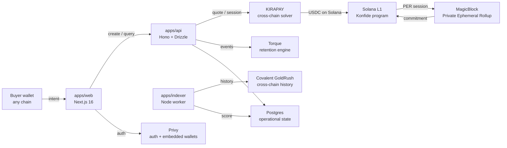

# Konfide

Konfide is confidential B2B payment infrastructure for cross-border trade in emerging markets. A Lagos importer paying a Shenzhen supplier today waits five days through correspondent banking, pays 4–7% all-in, and exposes commercially sensitive pricing on public chains if they switch to USDT-on-Tron. Konfide settles the same trade in 90 seconds at ~80 bps blended cost, with amounts and counterparties private by default but selectively disclosable to regulators. The wedge corridor is Lagos to Guangzhou, and the founder is in Lagos — which is the most defensible part of the moat.

[](./.github/workflows/ci.yml) [](./LICENSE) [](https://www.colosseum.org/) []()

## Contents

- [Why this exists](#why-this-exists)
- [What it does](#what-it-does)
- [Architecture](#architecture)
- [Sponsor integrations](#sponsor-integrations)
- [Quickstart](#quickstart)
- [Repository structure](#repository-structure)
- [Documentation](#documentation)
- [Hackathon submissions](#hackathon-submissions)
- [License](#license)
- [Team](#team)

## Why this exists

Cross-border B2B payments in emerging markets are the worst-served category in global finance. The Lagos–Guangzhou corridor alone is roughly $8B annually, with median invoice sizes between $5K and $50K, and SMEs paying multiples more than OECD businesses for the same kind of trade `[verify]`. The choices today are correspondent banking (slow, expensive, fragile), informal money changers (illegal or grey-market), or public USDT on Tron (fast and cheap but commercially exposing). None combine speed, cost, privacy, and a credible regulatory story. Konfide is built to combine all four for one corridor first, then to extend.

## What it does

- A Lagos importer creates an invoice in 30 seconds, sends a link to their Shenzhen supplier, and the supplier sees their counterparty's trust score before accepting.
- The buyer pays from any chain the KIRAPAY solver network supports — USDT on Polygon, USDC on Base, native SOL — and the seller is credited in USDC on Solana.
- Settlement runs through a MagicBlock Private Ephemeral Rollup. Public observers see "an invoice settled" on Solana mainnet but not who, how much, or for what.
- Trust scores update automatically from on-chain transaction history pulled via Covalent GoldRush. Repeat counterparty pairs earn programmable rebates through Torque.
- Onboarding is via email through Privy, which provisions a Solana embedded wallet without forcing the user to learn the words "seed phrase."
- Selective disclosure: a regulator with appropriate process can request a view key for a specific invoice or counterparty's history, decrypt the off-chain payload, and verify against the on-chain commitment.

## Architecture

Konfide uses ports and adapters (hexagonal architecture). The pure domain (`packages/core`) defines invoice, settlement, counterparty, and trust-score logic with zero external SDK dependencies. Each sponsor's SDK is wrapped in an adapter implementing one of five port interfaces: `PaymentRouter`, `PrivacyLayer`, `ChainData`, `Loyalty`, `Identity`. The Anchor program in `packages/contracts` is deliberately minimal — three instructions, each under 30 lines — because on-chain logic is auditable per byte.



Full architectural detail in [docs/ARCHITECTURE.md](./docs/ARCHITECTURE.md).

## Sponsor integrations

| Sponsor    | Integration                                          | Status   | Code location                            |
| ---------- | ---------------------------------------------------- | -------- | ---------------------------------------- |
| KIRAPAY    | Cross-chain checkout, the spine of payer settlement  | ⚪        | `packages/adapters/kirapay/`             |
| MagicBlock | Private Ephemeral Rollup for confidential settlement | ⚪        | `packages/adapters/magicblock/`          |
| Covalent   | Trust score from cross-chain transaction history     | ⚪        | `packages/adapters/covalent/`            |
| Torque     | Programmable rebates for repeat counterparty pairs   | ⚪        | `packages/adapters/torque/`              |
| Privy      | Embedded wallets and email-based onboarding          | ⚪        | `packages/adapters/privy/`               |

Legend: ✅ Complete · 🟡 In progress · ⚪ Planned (port abstraction in place, adapter scaffolded with method stubs) · ❌ Blocked.

Status updates as Phase 2–6 ship; see [ROADMAP.md](./ROADMAP.md) for the live progress.

## Quickstart

### Prerequisites

```bash
# Required
node --version    # >= 22.x  (use `nvm use` to read .nvmrc)
pnpm --version    # >= 9.x

# Optional (only needed for the on-chain program)
solana --version  # Solana CLI for devnet operations
anchor --version  # Anchor 0.30.x or 1.0.x for `anchor build`
psql --version    # Postgres client for local DB iteration
```

### Setup

```bash
# 1. Clone
git clone <repo-url> konfide
cd konfide

# 2. Configure environment
cp .env.example .env
# Fill in the keys — every line is annotated with provenance

# 3. Install dependencies (does NOT happen automatically)
pnpm install
```

### Common tasks

```bash
pnpm typecheck    # TypeScript across all packages
pnpm lint         # Biome lint + format check
pnpm test         # Vitest across all packages
pnpm build        # Build all packages and apps
pnpm dev          # Run all apps in dev mode
pnpm format       # Auto-format with Biome
pnpm check        # lint + typecheck + test
```

### Anchor program (optional)

```bash
cd packages/contracts
anchor build      # Builds the on-chain program
anchor test       # Runs tests against a local validator
```

`anchor build` is not required for the rest of the workspace to install and typecheck cleanly — see [packages/contracts/README.md](./packages/contracts/README.md) for installation instructions if you want to run it.

## Repository structure

```
konfide/
├── apps/
│   ├── web/         # Next.js 16 issuer dashboard + payer checkout
│   ├── api/         # Hono backend + Drizzle (Postgres)
│   ├── indexer/     # Background worker (trust score refresh)
│   └── docs/        # Nextra documentation site
├── packages/
│   ├── core/        # Pure domain (no external deps); ports + services
│   ├── adapters/    # Sponsor SDK wrappers, one package per sponsor
│   │   ├── kirapay/
│   │   ├── magicblock/
│   │   ├── covalent/
│   │   ├── torque/
│   │   ├── privy/
│   │   └── solana/
│   ├── contracts/   # Anchor workspace (programs/konfide)
│   ├── ui/          # Shared React components
│   ├── types/       # Zod schemas + inferred TypeScript types
│   └── config/      # Shared tsconfig / biome / tailwind
├── tooling/
│   ├── scripts/     # Devnet seed, trade simulation
│   └── fixtures/    # Test data
├── docs/
│   └── submissions/ # Per-sponsor hackathon submissions
└── .github/
    └── workflows/   # CI + contracts-test + deploy-docs
```

## Documentation

- [docs/ARCHITECTURE.md](./docs/ARCHITECTURE.md) — hexagonal pattern, data flow, privacy model, trust scoring, deployment topology.
- [docs/INTEGRATIONS.md](./docs/INTEGRATIONS.md) — one full section per sponsor with adapter file paths and SDK methods.
- [docs/BUSINESS_MODEL.md](./docs/BUSINESS_MODEL.md) — market, wedge, unit economics, GTM, moat, risks, the ask.
- [docs/CONTRIBUTING.md](./docs/CONTRIBUTING.md) — branch naming, commit style, hexagonal constraints, doc expectations.
- [docs/SECURITY.md](./docs/SECURITY.md) — threat model, protections, disclosure policy.
- [ROADMAP.md](./ROADMAP.md) — phase-by-phase progress tracker with checkbox state.

## Hackathon submissions

Konfide is submitted to the Solana Frontier Hackathon (Colosseum, May 2026) main track and four sponsor sidetracks.

| Track                    | Submission                                                                  | Deadline   |
| ------------------------ | --------------------------------------------------------------------------- | ---------- |
| Frontier main            | [docs/submissions/frontier-main.md](./docs/submissions/frontier-main.md)    | 2026-05-12 |
| KIRAPAY sidetrack        | [docs/submissions/kirapay.md](./docs/submissions/kirapay.md)                | 2026-05-20 |
| Covalent sidetrack       | [docs/submissions/covalent.md](./docs/submissions/covalent.md)              | 2026-05-26 |
| Torque sidetrack         | [docs/submissions/torque.md](./docs/submissions/torque.md)                  | 2026-05-26 |
| MagicBlock sidetrack     | [docs/submissions/magicblock.md](./docs/submissions/magicblock.md)          | 2026-05-27 |

## License

MIT — see [LICENSE](./LICENSE).