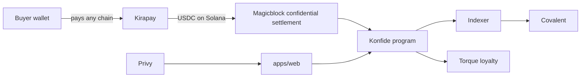

# Konfide

Konfide is a confidential B2B cross-border payment protocol on Solana. It lets exporters issue private invoices, accept payments in any chain/currency the buyer prefers, and settle on-chain without leaking sensitive trade-finance data. A trust-score primitive built from on-chain history rewards repeat counterparties and underwrites future credit.

## Architecture



## Sponsors integrated

- [ ] **Kirapay** — cross-border payment routing, payer-side checkout.
- [ ] **Magicblock** — confidential ephemeral-rollup settlement.
- [ ] **Covalent** — cross-chain history powering trust scores.
- [ ] **Torque** — counterparty retention & loyalty primitives.
- [ ] **Privy** — auth + embedded wallets for issuers and payers.

Per-sponsor submissions live under [`docs/submissions/`](./docs/submissions).

## Quickstart

```bash
pnpm install
pnpm typecheck
pnpm build
pnpm dev
```

## Repo layout

- `apps/web` — Next.js 16 issuer dashboard + payer checkout.
- `apps/api` — Hono backend + Drizzle (Postgres).
- `apps/indexer` — background worker that refreshes trust scores.
- `apps/docs` — Nextra documentation site.
- `packages/core` — pure domain model and ports (zero external deps).
- `packages/adapters/*` — sponsor-SDK implementations of core ports.
- `packages/contracts` — Anchor program (`programs/konfide`).
- `packages/types` — shared Zod schemas + inferred types.
- `packages/ui` — shared React components.
- `packages/config/*` — shared tsconfig / biome / tailwind config.

## License

MIT — see [LICENSE](./LICENSE).
