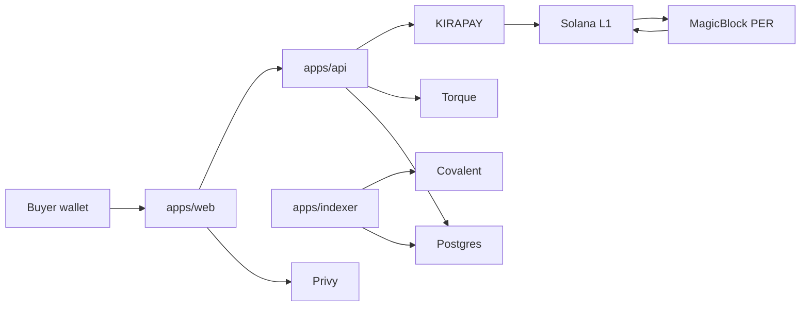
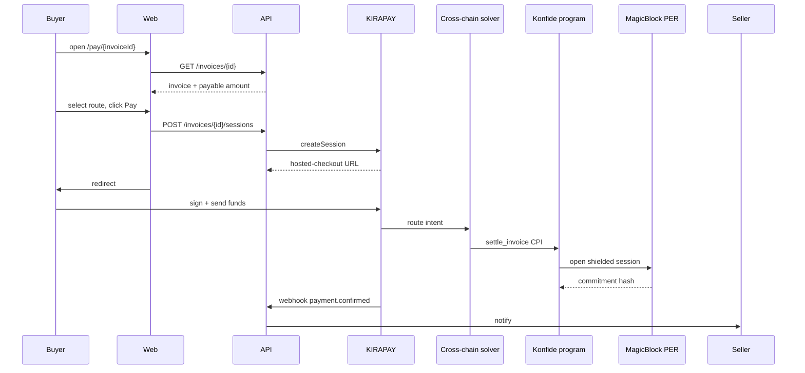

import { Callout, Steps } from 'nextra/components'

# Architecture

Konfide is built on hexagonal (ports + adapters) architecture. The pure domain defines invoice, settlement, counterparty, and trust-score logic with zero external SDK dependencies. Each sponsor's SDK is wrapped in an adapter that implements one of five port interfaces. The Anchor program is deliberately minimal because on-chain logic is auditable per byte.

This page is the public summary. The canonical version lives in [`docs/ARCHITECTURE.md`](https://github.com/konfide-protocol/konfide/blob/main/docs/ARCHITECTURE.md).

## The hexagonal pattern

There are three rules in this codebase, and they are non-negotiable.

<Steps>
### The domain is pure

`packages/core` may import from `packages/types` and from itself. It must not import from `@solana/*`, from any sponsor SDK, from `node:*`, or from any I/O primitive.

### Every external capability is a port

Ports are interfaces in `packages/core/src/ports`. Examples: `PaymentRouter`, `PrivacyLayer`, `ChainData`, `Loyalty`, `Identity`. A port is named for the capability, not for the provider.

### Every sponsor SDK is wrapped in an adapter

Adapters live in `packages/adapters/<sponsor>` and depend on `@konfide/core` and the sponsor's SDK. Replacing one sponsor with another means writing a new adapter, not editing the domain.
</Steps>

<Callout type="info">
The pattern earns its space for two reasons. First, sponsor SDKs change rapidly; keeping change radius contained limits blast radius. Second, a judge or auditor who wants to know "how deep is integration X" can read exactly one folder, `packages/adapters/<x>`, and reach a confident answer in minutes.
</Callout>

## System overview

## Privacy model

Konfide's privacy framing has three layers, not two. Most "privacy on-chain" work conflates the last two.

**Private.** Amounts, line items, memos, buyer-seller mappings, FX rates. Encrypted at rest in Postgres; transient in cleartext only inside a MagicBlock Private Ephemeral Rollup session.

**Public.** The fact that an invoice exists. The fact that it has been settled. The settlement commitment hash. The PDA address. Observable on Solana mainnet but observably uninformative.

**Selectively disclosable.** View keys. A regulator with appropriate process can request a view key for a specific scope. The view key decrypts the off-chain payload and verifies it against the on-chain commitment.

<Callout type="warning">
This is different from the Tron USDT model (everything public) and from a fully shielded model (no audit path). Konfide sits between: private by default, auditable by design.
</Callout>

## End-to-end settlement

## Read more

- [Integrations](/integrations) — one section per sponsor.
- [Business model](/business) — market, wedge, unit economics, moat.
- [Submissions](/submissions) — hackathon submission docs.
- Full architectural detail: [`docs/ARCHITECTURE.md`](https://github.com/konfide-protocol/konfide/blob/main/docs/ARCHITECTURE.md).
