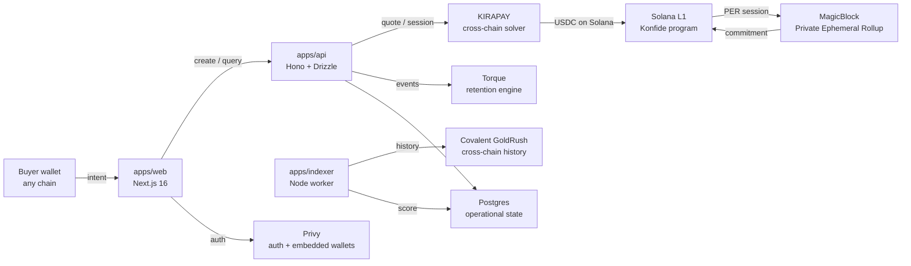

import { Cards, Callout } from 'nextra/components'

# Konfide

Konfide is confidential B2B payment infrastructure for cross-border trade in emerging markets. A Lagos importer paying a Shenzhen supplier today waits five days through correspondent banking, pays 4–7% all-in, and exposes commercially sensitive pricing on public chains if they switch to USDT-on-Tron. Konfide settles the same trade in 90 seconds at ~80 bps blended cost, with amounts and counterparties private by default but selectively disclosable to regulators.

The wedge corridor is Lagos to Guangzhou, and the founder is in Lagos — which is the most defensible part of the moat.

## Architecture at a glance

## Start here

<Cards>
  <Cards.Card title="For judges" href="/submissions">
    Hackathon submission docs, one per sidetrack, with judging-criteria alignment and demo links.
  </Cards.Card>
  <Cards.Card title="For developers" href="/architecture">
    Architecture, ports + adapters, privacy model, trust scoring, deployment topology.
  </Cards.Card>
  <Cards.Card title="For investors" href="/business">
    Market, wedge, unit economics, go-to-market, moat, the ask.
  </Cards.Card>
</Cards>

<Callout type="info">
This site is the public version of the project's documentation. The full repo, including the canonical `docs/` folder, is on [GitHub](https://github.com/konfide-protocol/konfide) `[TBD: real URL once repo is public]`.
</Callout>
