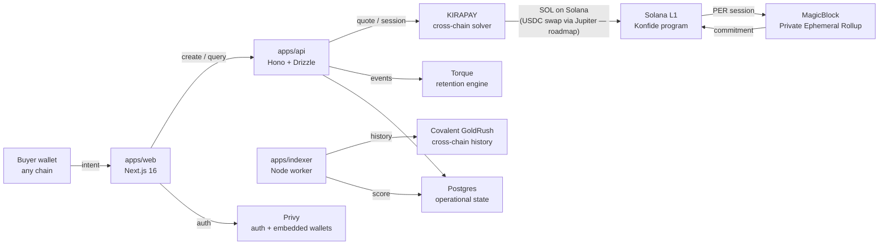
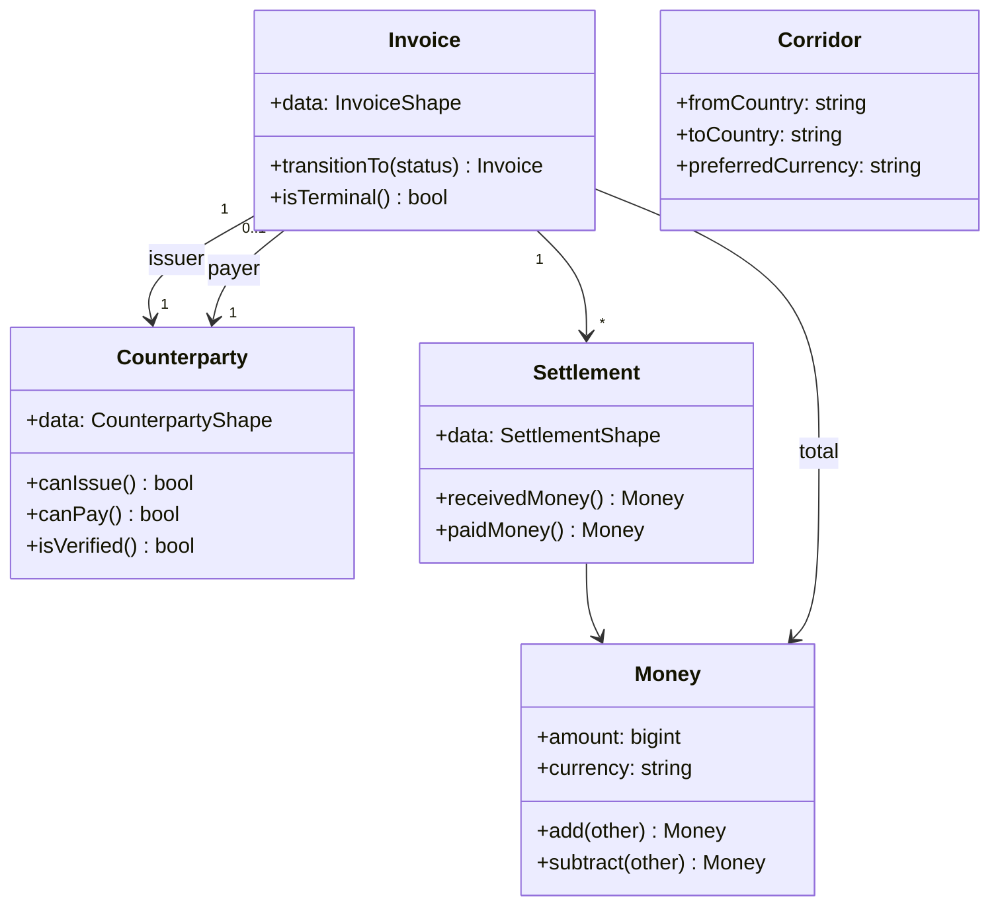
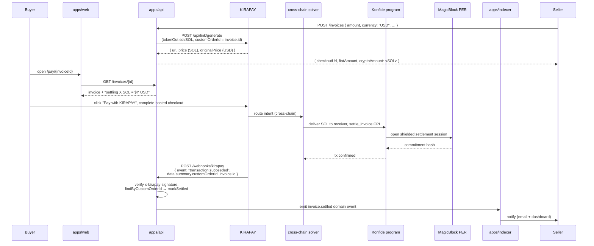

# Architecture

This document describes the technical architecture of Konfide. Its intended readers are technical judges evaluating the project for a hackathon prize, contributors deciding where a change belongs, and engineers we want to hire after the hackathon. It is the canonical reference for how the system is structured and why.

## Contents

- [System overview](#system-overview)
- [The hexagonal pattern](#the-hexagonal-pattern)
- [Core domain model](#core-domain-model)
- [Ports](#ports)
- [Adapters](#adapters)
- [Anchor program](#anchor-program)
- [End-to-end settlement flow](#end-to-end-settlement-flow)
- [Privacy model](#privacy-model)
- [Trust scoring](#trust-scoring)
- [Database schema](#database-schema)
- [Auth and identity](#auth-and-identity)
- [Deployment topology](#deployment-topology)
- [Security model](#security-model)
- [What we deliberately do not do](#what-we-deliberately-do-not-do)

## System overview

Konfide is composed of four runnable processes (`apps/web`, `apps/api`, `apps/indexer`, `apps/docs`), six adapter packages that wrap sponsor SDKs (`packages/adapters/*`), a pure domain core (`packages/core`), shared types (`packages/types`), shared UI (`packages/ui`), and an Anchor program (`packages/contracts`). Everything is a TypeScript workspace except the on-chain program, which is Rust.



Every external system is reached through an adapter that implements a port defined in `packages/core/src/ports`. The same architectural rule applies to the database, which is reached through Drizzle from `apps/api`, not from `packages/core`.

## The hexagonal pattern

Konfide uses ports and adapters (sometimes called hexagonal architecture). The pattern has three rules in this codebase, and they are non-negotiable.

First, the domain is pure. `packages/core` may import from `packages/types` and from itself. It must not import from `@solana/*`, from any sponsor SDK, from `node:*`, or from any I/O primitive. The CI typecheck pass would not catch every violation, so the rule is enforced by code review and by the fact that none of those packages are listed as dependencies in `packages/core/package.json`.

Second, every external capability is expressed as a port. A port is an interface declared in `packages/core/src/ports`. Examples are `PaymentRouter` (for cross-chain checkout), `PrivacyLayer` (for confidential settlement), `ChainData` (for on-chain history queries), `Loyalty` (for retention primitives), and `Identity` (for auth and wallets). A port is named for the capability, not for the provider — `PaymentRouter`, not `KirapayClient`.

Third, every sponsor SDK is wrapped in an adapter that implements one or more ports. Adapters live in `packages/adapters/<sponsor>` and depend on `@konfide/core` and the sponsor's SDK. The adapter is the only place where a sponsor's API surface appears in the codebase; replacing KIRAPAY with a different routing partner would mean writing a new adapter, not editing the domain.

This pattern earns its space for two reasons. The first is risk insulation: sponsor SDKs change rapidly, sometimes silently. Keeping that change radius contained to one adapter package limits the blast radius of any breaking update. The second is legibility: a judge or auditor who wants to know "how deep is the KIRAPAY integration" can read exactly one folder, `packages/adapters/kirapay`, and reach a confident answer in minutes.

## Core domain model

The domain model lives in `packages/core/src/domain/` and is the conceptual centre of the project. Each file declares one aggregate or value object with the invariants that go with it.

`Invoice` (`invoice.ts`) is the central aggregate. It wraps the `InvoiceShape` from `@konfide/types` and exposes a single behavioural method, `transitionTo`, which enforces the legal status transitions: `draft → issued → awaiting_payment → settled` is the happy path; `disputed`, `voided`, and `expired` are terminal or near-terminal branches. Transitions return a fresh `Invoice` rather than mutating in place, so the aggregate is effectively immutable from the outside.

`Counterparty` (`counterparty.ts`) wraps a counterparty's off-chain handle and on-chain wallet, plus a verification flag. It exposes `canIssue` and `canPay` predicates so callers do not branch on the raw `kind` enum.

`Settlement` (`settlement.ts`) records the on-chain side of a payment. It carries the route taken (KIRAPAY direct, KIRAPAY swap, MagicBlock confidential, or on-chain native), the amounts paid and received, and the transaction signature.

`Money` (`money.ts`) is a value object wrapping `bigint` minor units plus a currency code. Arithmetic is currency-checked: adding `USD(1000)` to `USDC(1000)` throws at runtime rather than silently producing a wrong result.

`Corridor` (`corridor.ts`) is a directional pair of jurisdictions plus an optional preferred currency. We use corridors to choose payment routes and to bucket analytics. The Lagos-Guangzhou corridor is the wedge; everything else is corridor-by-corridor expansion.

Brand types in `value-objects.ts` give us compile-time discrimination between strings that look identical at runtime: `WalletAddress`, `ChainId`, `TokenAddress`, `InvoiceId`, `CounterpartyId`, `SettlementId`. The constructors validate shape, not authenticity.



## Ports

Ports are interface-only. They declare what the domain needs from the outside world without describing how to satisfy it.

| Port             | File                                          | Responsibility                                                                                                |
| ---------------- | --------------------------------------------- | ------------------------------------------------------------------------------------------------------------- |
| `PaymentRouter`  | `packages/core/src/ports/payment-router.ts`   | Quote routes, open hosted-checkout sessions, and resolve sessions into final settlements once funds arrive.   |
| `PrivacyLayer`   | `packages/core/src/ports/privacy-layer.ts`    | Begin a confidential settlement session and produce a public commitment without leaking amounts on L1.        |
| `ChainData`      | `packages/core/src/ports/chain-data.ts`       | Fetch cross-chain transfer history for a wallet, used to compute trust scores.                                |
| `Loyalty`        | `packages/core/src/ports/loyalty.ts`          | Record retention events and fetch active campaigns for a counterparty.                                        |
| `Identity`       | `packages/core/src/ports/identity.ts`         | Verify session tokens and provision embedded wallets for users.                                               |

The barrel export `packages/core/src/ports/index.ts` is the single import point for adapters.

## Adapters

Each adapter package depends only on `@konfide/core`, `@konfide/types`, and the sponsor SDK it wraps. Cross-adapter dependencies are forbidden; if two adapters need to coordinate, they coordinate through a service in `packages/core/src/services/`.

| Adapter                          | Implements        | Wraps                                                       | Status (see ROADMAP.md)             |
| -------------------------------- | ----------------- | ----------------------------------------------------------- | ----------------------------------- |
| `@konfide/adapter-kirapay`       | `PaymentRouter`   | KIRAPAY REST API + webhooks                                 | Stubbed; Phase 2                    |
| `@konfide/adapter-magicblock`    | `PrivacyLayer`    | MagicBlock Private Ephemeral Rollup endpoint                | Stubbed; Phase 6                    |
| `@konfide/adapter-covalent`      | `ChainData`       | Covalent GoldRush unified-data API                          | Stubbed; Phase 4                    |
| `@konfide/adapter-torque`        | `Loyalty`         | Torque retention API                                        | Stubbed; Phase 5                    |
| `@konfide/adapter-privy`         | `Identity`        | `@privy-io/react-auth` + Privy server-side verification     | Stubbed; Phase 2 (auth gate)        |
| `@konfide/adapter-solana`        | (program client)  | `@solana/web3.js@2` + `@coral-xyz/anchor`                   | Stubbed; Phase 2 (settle_invoice)   |

The Solana adapter is unusual because it does not implement a port — it is the typed client for our own on-chain program. Other adapters consume it indirectly when they need to submit instructions.

## Anchor program

The on-chain program (`packages/contracts/programs/konfide`) is deliberately minimal. Three instructions:

- `create_invoice(invoice_id: [u8; 16])` — initialises a PDA at `[b"invoice", invoice_id]` with the issuer as authority. Stores the issuer pubkey, expected payer pubkey, status code, creation slot, and a zero-byte settlement commitment.
- `settle_invoice()` — flips the invoice status to `settled` and writes the settlement commitment hash. Authority is the payer (or the privacy layer's CPI signer once Phase 6 lands).
- `record_dispute(reason_hash: [u8; 32])` — flips the status to `disputed` and stores a 32-byte hash that points to off-chain dispute evidence. Authority is either party.

The program's job is to be the auditable spine, not the business logic. Everything else — line items, decryption keys, FX rates, dispute evidence — lives off-chain. The rationale is that on-chain logic is auditable per byte and immutable per upgrade authority; off-chain logic is iterable per minute. Pushing everything we can off-chain keeps the program small enough to audit cheaply and stable enough to lock the upgrade authority quickly.

State for amount and counterparty mapping does not live on L1 in the long run. It lives in MagicBlock's Private Ephemeral Rollup; only the commitment hash lands on L1. See [Privacy model](#privacy-model) below.

## End-to-end settlement flow

The most informative way to read this codebase is to trace one settlement from buyer click to seller-credited balance. The diagram below walks the path; the prose under it annotates the state changes.



The arrows the judge should focus on are the three between `Solver`, `Program`, and `PER`. Confidential state lives in the rollup; the L1 program retains only the commitment plus a status flag. The webhook from KIRAPAY to the API is the trigger that moves the off-chain database into agreement with the on-chain truth.

## Privacy model

Konfide's privacy framing is the single most important piece of architecture to evaluate. The framing has three layers, not two: private, public, and selectively disclosable. Most "privacy on-chain" work conflates the last two.

What is private. The amount of every settlement, the line items, the memo, the buyer-seller mapping, and the FX rate at which the trade was struck. None of these touch L1 in cleartext. They live encrypted at rest in Postgres, with the encryption key derived from a Privy-provisioned key for the issuer and a session key for the payer. They live unencrypted but ephemerally inside the MagicBlock Private Ephemeral Rollup during a settlement session.

What is public. The fact that an invoice exists. The fact that it has been settled. The settlement commitment hash. The PDA address of the invoice. These are observable on Solana mainnet. A regulator or a competitor watching mainnet can know that two pseudonymous parties have settled some quantity of some asset; they cannot know who, how much, or for what.

What is selectively disclosable. View keys. The protocol design assumes that a regulator with appropriate process — a Nigerian CBN compliance officer, a UAE VARA inspector, a Chinese tax auditor — should be able to request a view key for a specific invoice or a specific counterparty's history. The view key decrypts the off-chain encrypted payload and verifies it against the on-chain commitment. The protocol does not grant view keys automatically; it provides the cryptographic primitive and a documented disclosure flow. The decision to grant a view key is a legal and operational decision, not a technical one.

This is different from the Tron USDT model, where everything is public and there is no selective disclosure because there is nothing to selectively reveal. It is also different from a fully shielded model (e.g. Aleo) where regulators have no path to information without the user's voluntary cooperation. Konfide sits between: private by default, auditable by design.

## Trust scoring

A trust score is a counterparty-level signal extracted from on-chain history. It is the output of a pure scoring function in `packages/core/src/domain/trust-score.ts` (the `tierForScore` mapper plus the `TrustScoreInputs` shape) combined with the `ScoringService` in `packages/core/src/services/scoring-service.ts` that calls the `ChainData` port to fetch features.

The features we extract are:

- Wallet age in days (older wallets are harder to fake).
- Total inflow volume in USD-equivalent.
- Total outflow volume in USD-equivalent.
- Distinct counterparty count over the last 12 months.
- Recurring counterparty count (counterparties seen in ≥ 3 distinct months).
- Dispute event count (from our own program logs).
- Settlement velocity (median time from `awaiting_payment` to `settled`).
- Latest activity recency in days.

The scoring formula is `[TBD: actual weights pending tuning against a labelled dataset]`. The output is a score in `[0, 1000]` mapped to one of five tiers (`unrated`, `bronze`, `silver`, `gold`, `platinum`) per the thresholds in `tierForScore`.

The score is hard to fake because each feature requires a costly real-world action. Aging a wallet costs months. Generating diverse counterparty interactions costs gas, time, and either real money or coordinated wash trading that is itself observable. Avoiding disputes requires actually paying invoices on time. The expected cost of forging a `gold`-tier score over a 12-month window exceeds the expected fraud yield of any single trade we expect to underwrite. That is the working hypothesis; Phase 4 produces the data to validate it.

## Database schema

Operational state lives in Postgres, accessed through Drizzle. The schema is in `apps/api/src/db/schema.ts`. We persist only what the protocol needs to coordinate off-chain — sensitive trade data is encrypted at the application layer before it lands in the `encrypted_payload` column on `invoices`.

```mermaid
erDiagram
    counterparties ||--o{ invoices : "issuer / payer"
    invoices ||--o{ settlements : "has"
    counterparties ||--|| trust_scores : "rated by"

    counterparties {
        uuid id PK
        text handle UK
        text display_name
        text kind
        text primary_wallet
        text jurisdiction
        text verified
        timestamptz created_at
    }
    invoices {
        uuid id PK
        uuid issuer_id FK
        uuid payer_id FK
        text status
        bigint total_amount
        text total_currency
        text encrypted_payload
        timestamptz due_at
        timestamptz created_at
        timestamptz updated_at
        timestamptz settled_at
        text on_chain_ref
    }
    settlements {
        uuid id PK
        uuid invoice_id FK
        text route
        text paid_by
        bigint paid_amount
        text paid_currency
        bigint received_amount
        text received_currency
        text tx_signature
        text chain_id
        timestamptz confirmed_at
    }
    trust_scores {
        uuid counterparty_id PK_FK
        bigint score
        text tier
        jsonb factors
        timestamptz computed_at
    }
```

`encrypted_payload` is opaque to the database; the API encrypts before insert and decrypts only after authorising the reader against the issuer or payer identity. `on_chain_ref` stores the PDA address of the matching invoice account on Solana for cross-reference.

## Auth and identity

Authentication is done via Privy. The `apps/web` app wraps its layout in `<PrivyProviderShell />` (currently a stub; production wiring is Phase 2). Privy issues a session token that the API verifies via `PrivyIdentity.verifyToken`. Once verified, the API knows the user's id and the wallet addresses Privy has provisioned for them.

Embedded wallets give us emerging-market user onboarding without forcing a Phantom install on a Lagos importer who has never used a wallet. Privy provisions a Solana keypair custodially with key shards on the user's device and Privy's infrastructure; the user can later export to a self-custody wallet if they want.

A future upgrade path is World ID for verified business accounts. World ID's proof-of-personhood gives us a low-cost defence against farmed counterparties, which complements but does not replace the on-chain trust score. We have not committed to this yet — it is a Phase 8 decision.

## Deployment topology

For the hackathon demo we plan the following deployment:

- `apps/web` — Vercel (Next.js native).
- `apps/docs` — Vercel.
- `apps/api` — Fly.io (long-lived process; webhook receivers benefit from steady connections).
- `apps/indexer` — Fly.io (background worker).
- Postgres — Neon (serverless Postgres with branching).
- Solana RPC — Helius (devnet for the demo, mainnet for any post-hackathon pilot).
- DNS / TLS — Cloudflare.

Production-grade deployment (rate limiting, log aggregation, on-call) is Phase 8, not hackathon scope.

## Security model

The threat model is documented in [SECURITY.md](./SECURITY.md). The most relevant invariants for the architecture are:

- All webhook endpoints verify HMAC SHA-256 signatures with the secret stored only in deployment env (never in code, never in `.env.example`).
- All inbound HTTP requests at trust boundaries are validated against a Zod schema from `@konfide/types`.
- The Solana program upgrade authority is held by a multisig that the founder does not solely control (post-hackathon).
- No private keys live in the repo; CI uses ephemeral keypairs generated per run.
- Every adapter is responsible for sanitising its sponsor's data before it crosses into the domain. The domain trusts the types, not the bytes.

## What we deliberately do not do

- We do not run our own cross-chain solver. KIRAPAY is the spine, end of story. Building a solver in three weeks is unrealistic, and competing with KIRAPAY's solver network is not the wedge.
- We do not run our own L2 or sidechain. MagicBlock's PER is the privacy substrate.
- We do not custody fiat. All on-ramps and off-ramps go through licensed partners.
- We do not implement a token. The protocol does not need one. Adding one for fundraising reasons is a decision that gets made later, with legal counsel, not now.
- We do not build a native mobile app for the hackathon. The PWA on `apps/web` is enough to demo a Lagos importer's flow.
- We do not implement a secondary market for invoice receivables. That is a credible follow-on product but it is Phase 8 at the earliest.
