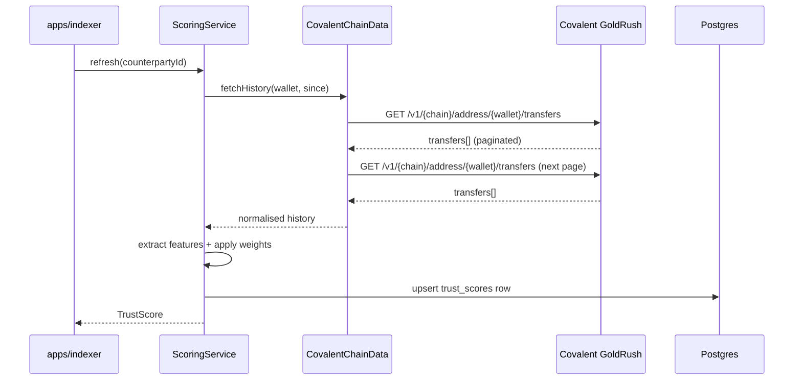

# Konfide × Covalent GoldRush

This document is the submission for the Covalent sidetrack of the Solana Frontier Hackathon. Its intended reader is a Covalent judge looking for a creative application of GoldRush data — Covalent explicitly invites creative use cases, and the trust-score primitive Konfide builds with GoldRush is exactly that.

## Project name

Konfide.

## One-liner

A native counterparty trust score for cross-border B2B trade, computed from cross-chain transaction history pulled via Covalent GoldRush.

## Problem

Trade credit in cross-border B2B is broken in emerging markets. Today a Lagos importer who wants to know whether to pre-pay a Shenzhen supplier — or a Shenzhen supplier who wants to know whether to ship before payment confirms — relies on three tools: trade credit insurance (slow, expensive, only for large players), broker references (informal, hard to verify, not portable), and letters of credit (bank-mediated, multi-day, designed for a different era).

None of these scale to crypto-native settlement. A trade settled in 90 seconds cannot be underwritten by an insurance review that takes three weeks, cross-checked against bank-issued LCs, or vouched for by a broker who has never met either party. The result: SMEs default to pre-payment based on personal trust, which limits volume to relationships built over years and excludes new pairs from the market.

The right primitive for this problem is on-chain trust history. Both parties already leave on-chain trails — payments to suppliers, payments from buyers, dispute events, settlement velocity. What has not existed until now is a way to extract those signals at scale, across all the chains a counterparty has used, in a normalised shape that supports a real-time scoring function. Covalent's GoldRush API is the data layer that makes this possible.

## The native trust score as the solution

The Konfide trust score is a counterparty-level signal in `[0, 1000]`, mapped to one of five tiers (`unrated`, `bronze`, `silver`, `gold`, `platinum`). It appears next to every counterparty's name on every invoice, in the dashboard, and on the public payer page. It updates as the counterparty accumulates new on-chain history.

The score answers two questions concretely. First: should I extend net-30 terms to this buyer, or insist on pre-payment? A `gold`-tier buyer with a 12-month no-dispute history makes net-30 a reasonable underwriting decision; an `unrated` buyer makes it a risky one. Second: should I ship to this supplier before settlement confirms? A `platinum`-tier supplier with a high settlement-velocity score makes ship-before-confirm low-risk; a `bronze`-tier supplier makes it not.

The score is not advice. It is a cryptographically-grounded signal that a credit officer (or, post-Phase-8, an underwriting algorithm) uses as one input among several. The advantage over off-chain alternatives is that the inputs are observable, the computation is reproducible, and the score updates in real time as new trades settle.

## Trust scoring algorithm

Features extracted per counterparty wallet:

| Feature                              | Description                                                       | Source via GoldRush             |
| ------------------------------------ | ----------------------------------------------------------------- | ------------------------------- |
| Wallet age in days                   | First-seen timestamp; older wallets are harder to fake.           | Wallet activity endpoint        |
| Total inflow volume USD              | Cumulative inbound transfers across supported chains.             | Transfers endpoint              |
| Total outflow volume USD             | Cumulative outbound transfers across supported chains.            | Transfers endpoint              |
| Distinct counterparty count (12mo)   | Number of unique counterparties in last 12 months.                | Transfers endpoint              |
| Recurring counterparty count         | Counterparties seen in ≥ 3 distinct months.                       | Transfers endpoint, derived     |
| Dispute event count                  | Disputes raised against this counterparty in Konfide.             | Konfide program logs            |
| Settlement velocity                  | Median time from `awaiting_payment` to `settled`.                 | Konfide internal records        |
| Latest activity recency in days      | Days since the last transfer in or out.                           | Transfers endpoint              |

Weighting approach: each feature is normalised into `[0, 1]` and combined with weights `[TBD: actual weights pending tuning against a labelled dataset of pilot users]`. The output is scaled to `[0, 1000]` and bucketed:

| Tier      | Score range |
| --------- | ----------- |
| platinum  | 900–1000    |
| gold      | 750–899     |
| silver    | 500–749     |
| bronze    | 250–499     |
| unrated   | 0–249       |

Implementation: the pure scoring function is in `packages/core/src/domain/trust-score.ts` (the `tierForScore` mapper plus the `TrustScoreInputs` shape). The orchestration that calls Covalent and persists the result is in `packages/core/src/services/scoring-service.ts`, with the Covalent adapter in `packages/adapters/covalent/`.

## GoldRush API endpoints used

- **Transfers endpoint** — fetch ERC-20 / SPL transfer history for a wallet with pagination. Powers the inflow/outflow volume features, the counterparty diversity features, and the recency feature. Called from `CovalentClient.fetchTransfers`.
- **Wallet activity endpoint** — first-seen and last-seen timestamps. Powers the wallet-age and recency features. `[verify: confirm exact endpoint name in GoldRush docs]`.
- **Balance history endpoint** — used for volume sanity checks (large-volume features should reconcile against actual balance flows). `[verify]`.

The adapter is currently scaffolded with method stubs. Real integration is Phase 4 in the [roadmap](../../ROADMAP.md#phase-4--covalent-trust-scoring), targeting 2026-05-26. Status at submission time: `[TBD]`.

## Integration walkthrough

The indexer (`apps/indexer/src/workers/trust-score-refresher.ts`) schedules score refreshes for stale counterparties. The Covalent adapter normalises across chains so the scoring service does not branch on chain id.

## Why this is hard to fake

Each feature in the score requires a costly real-world action. Aging a wallet costs months of elapsed time. Building diverse counterparty interactions costs gas plus either real money or coordinated wash trading that is itself observable through transfer-graph clustering. Avoiding disputes requires actually paying invoices on time. The expected cost of forging a `gold`-tier score over a 12-month window — across multiple chains, with diverse counterparties and no disputes — exceeds the expected fraud yield of any single trade Konfide expects to underwrite.

Specifically: the cheapest plausible attack is to acquire an existing aged wallet on a secondary market, but those wallets do not have Konfide-relevant counterparty graphs. The next cheapest is to maintain a botnet of wallets that interact with each other to manufacture diversity, but transfer-graph clustering catches dense subgraphs of mutual transfers. The cheapest attack that defeats both — a real businesses' aged wallet with genuine diverse history — costs the price of a real business, which dwarfs the trade Konfide is underwriting.

This is the working hypothesis. Phase 4 produces the data to validate it.

## Edge cases

**Cold start.** A wallet with no history scores `unrated`. The UI explicitly labels this rather than rendering a misleading low score. Cold-start handling is part of the product, not a bug — it is what makes the score honest. New buyer-seller pairs onboard at `unrated` and accrue history through Konfide-mediated trades.

**Mixed activity.** B2B + DeFi noise dilutes counterparty diversity if not filtered. We classify counterparties (DEX router, AMM pool, CEX deposit address, MEV bot) and exclude DeFi-shaped activity from the diversity and recurrence counts. The classification is heuristic and improves over time as Konfide accumulates labelled data.

**Rotated wallets.** The trust score is wallet-scoped, not user-scoped. A user who rotates wallets restarts at `unrated`. Future work (post-Phase-8) is cryptographic linkage between wallets a user controls, so rotation does not destroy reputation; out of scope for the hackathon.

**Cross-chain reconciliation.** The same logical counterparty may have wallets on Solana, Polygon, and Ethereum. We aggregate by deriving a single `Counterparty` record that links multiple wallets — currently manually, in the post-Phase-8 design via verifiable cross-chain identity primitives.

**Dispute-feature lag.** Disputes are recorded in the Konfide program (`record_dispute` instruction), not in GoldRush data. The scoring service composes both sources.

## Code references

- Port: `packages/core/src/ports/chain-data.ts`
- Adapter: `packages/adapters/covalent/src/covalent-adapter.ts`
- Client: `packages/adapters/covalent/src/client.ts`
- Pure scoring helpers: `packages/core/src/domain/trust-score.ts`
- Scoring orchestration: `packages/core/src/services/scoring-service.ts`
- Indexer worker: `apps/indexer/src/workers/trust-score-refresher.ts`
- UI badge: `packages/ui/src/components/trust-score-badge.tsx`

## Demo

- **Video** — `[TBD: 3-minute demo showing trust score change as a simulated counterparty settles invoices]`.
- **Live demo** — `[TBD]`.
- **GitHub** — `[TBD]`.

## Submission requirements checklist

`[verify against final Covalent brief]`:

- [ ] Working demo using GoldRush API.
- [ ] Public GitHub repository.
- [ ] Video demonstration.
- [ ] Clear explanation of features extracted and how they compose into the score (see "Trust scoring algorithm" above).
- [ ] Code references showing the GoldRush integration depth.
