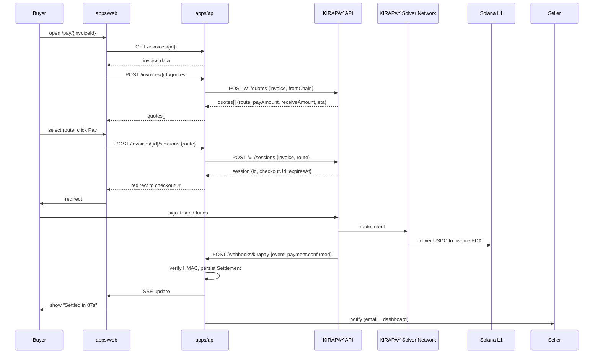

# Konfide × KIRAPAY

This document is the submission for the KIRAPAY sidetrack of the Solana Frontier Hackathon. Its intended reader is a KIRAPAY judge evaluating the depth of integration in five minutes of reading. KIRAPAY weights "Depth of Integration" at 40%, so this document is structured to demonstrate that depth concretely rather than rhetorically.

## Project name

Konfide.

## One-liner

Confidential B2B payment rails for cross-border trade in emerging markets, with KIRAPAY as the cross-chain spine.

## Problem

Lagos importers pay Shenzhen suppliers in $5K–50K trade-finance amounts, every two to four weeks, year after year. Today they pay 4–7% all-in via correspondent banking, with five-day settlement and Wise accounts that get flagged for compliance review. The crypto alternative — public USDT on Tron — is faster and cheaper but exposes their pricing and customer relationships to anyone watching the explorer. Neither option is acceptable.

The fix requires three properties at once: any-chain-in for the buyer (because Lagos importers do not all hold the same stablecoin on the same chain), USDC-on-Solana out for the seller (because Solana is the only base layer that supports the rest of Konfide's stack), and a 90-second user experience (because anything slower loses to USDT-on-Tron in head-to-head). KIRAPAY is the only product on the market that delivers all three.

## How KIRAPAY is the spine, not an add-on

This framing matters because it determines what "depth of integration" means for this submission.

Konfide does not have a fallback to KIRAPAY for the payer-side flow. KIRAPAY is the payer-side flow. Without KIRAPAY's intent layer, Konfide's value proposition collapses to "Solana-only payments for Solana-native buyers," which is the wrong wedge for the Lagos-Guangzhou corridor. The alternative would be building our own cross-chain solver network in three weeks, which is unrealistic, or limiting Konfide to one source chain, which loses 80% of the wedge customer base.

The architecture reflects this. The `PaymentRouter` port (`packages/core/src/ports/payment-router.ts`) is the abstraction Konfide's domain talks to for cross-chain checkout. KIRAPAY is the only implementation that ships for the hackathon. We deliberately did not implement a fallback adapter because adding a second `PaymentRouter` implementation is a six-month decision, not a hackathon-week decision — and the abstraction keeps the door open for that decision later without forcing it now.

## Integration walkthrough

Every KIRAPAY API surface Konfide consumes, with the user-facing flow that triggers it.

The KIRAPAY surfaces exercised:

- **Quote endpoint** — invoked from `KirapayPaymentRouter.quote()` in `packages/adapters/kirapay/src/kirapay-adapter.ts`. We pass the invoice's USDC-on-Solana destination plus the buyer's source chain. The response is a list of routes ranked by total cost; we expose all of them in the UI rather than only the cheapest, because the buyer often wants visible control.
- **Session creation endpoint** — invoked from `KirapayPaymentRouter.createSession()` once the buyer has chosen a route. Returns a hosted-checkout URL the buyer is redirected to.
- **Session resolution endpoint** — invoked from `KirapayPaymentRouter.resolveSession()` as a polling backstop in case a webhook is missed. The webhook is the primary signal; this is the secondary.
- **Webhooks** — `payment.confirmed`, `payment.failed`, `payment.partial` consumed at `POST /webhooks/kirapay` in `apps/api/src/routes/webhooks.ts`. Every webhook is HMAC SHA-256 verified against `KIRAPAY_WEBHOOK_SECRET`; unsigned webhooks are rejected with 401 before any application logic runs.

`[verify against KIRAPAY docs: confirm exact endpoint paths and webhook event names]`.

## Edge cases handled

These are the cases that distinguish a real integration from a demo path.

**Wallet detection.** When the buyer connects, KIRAPAY's checkout auto-detects the source chain from the connected wallet. We surface this back into the Konfide UI so the quote refreshes if the buyer switches networks mid-flow. `[verify: confirm KIRAPAY's wallet-detection API surface]`.

**Payment timeout retries.** If the buyer signs but the source chain is slow (Polygon during congestion, for example), the session can age out before the funds arrive. We poll the resolution endpoint at 5s, 15s, 60s before surfacing a "still processing — check back" state. The buyer's funds are not stuck — KIRAPAY's solver network handles delivery — but the UI should not lie about latency.

**Partial settlements.** A `payment.partial` webhook event maps to invoice status `partially_paid`. The seller's dashboard shows the partial amount and the remaining balance; the buyer's payer page invites them to complete the remainder.

**Multi-token routing fallbacks.** If the buyer's preferred token is unavailable on their source chain (e.g. they have USDT-on-BSC but want to pay in USDC), the quote endpoint returns routes through whatever stablecoin is liquid on that chain. The Konfide UI shows the FX implication transparently.

**Webhook replay.** Idempotency is keyed on `(sessionId, eventType, eventTimestamp)`. A duplicate webhook (e.g. retry from KIRAPAY's side after our 5xx) is acknowledged but does not double-credit.

**Session expiry mid-flow.** If a buyer abandons checkout and returns 30 minutes later, the session may have expired. The Konfide UI detects this from the session-resolution response and offers to reissue.

## What we would build deeper given more time

Three integrations we explicitly want but cannot ship in three weeks:

- **Subscription invoices.** Recurring monthly trade between the same Tunde-Wei pair. KIRAPAY's session model is per-trade today; subscription would require either KIRAPAY-side primitives or a Konfide-side scheduler that creates fresh sessions on a cadence.
- **Multi-leg settlement.** Trades that route across three or more chains because the buyer holds funds split across multiple wallets. KIRAPAY's solver network may already support this `[verify]`; Konfide's UI does not yet.
- **Bulk invoice issuance.** A Lagos importer creating 30 invoices to 30 suppliers at once, all settled through KIRAPAY in a single hosted checkout session.

## Code references

- Port: `packages/core/src/ports/payment-router.ts`
- Adapter: `packages/adapters/kirapay/src/kirapay-adapter.ts`
- HTTP client wrapper: `packages/adapters/kirapay/src/client.ts`
- Webhook receiver: `apps/api/src/routes/webhooks.ts` (`POST /webhooks/kirapay`)
- Public payer page: `apps/web/app/pay/[invoiceId]/page.tsx`
- Webhook receiver (web app variant for the demo): `apps/web/app/api/webhooks/kirapay/route.ts`

## Demo

- **Video** — `[TBD: 3-minute demo showing Lagos buyer paying with USDT-on-Polygon, settled in USDC-on-Solana through KIRAPAY]`.
- **Live demo** — `[TBD: stable URL on devnet]`.
- **GitHub** — `[TBD]`.

## Submission requirements checklist

KIRAPAY's published submission requirements `[verify against final brief]`:

- [ ] English-language write-up (this document).
- [ ] Working prototype with successful KIRAPAY API integration on devnet.
- [ ] Public GitHub repository.
- [ ] Video demonstration ≤5 minutes.
- [ ] Demo of every KIRAPAY surface used (quotes, sessions, webhooks).
- [ ] Repo includes clear references to KIRAPAY adapter code (see Code references above).
