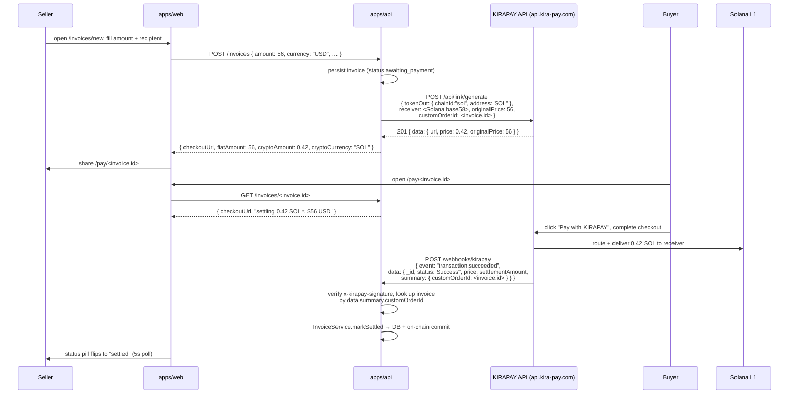

# Konfide × KIRAPAY

This document is the submission for the KIRAPAY sidetrack of the Solana Frontier Hackathon. KIRAPAY weights "Depth of Integration" at 40%, so this document is structured to demonstrate that depth concretely against the real KIRAPAY API (base URL `https://api.kira-pay.com`).

## Project name

Konfide.

## One-liner

Confidential B2B payment rails for cross-border trade in emerging markets, with KIRAPAY as the cross-chain spine and SOL-on-Solana as the merchant settlement leg.

## Problem

Lagos importers pay Shenzhen suppliers in $5K–50K trade-finance amounts, every two to four weeks, year after year. Today they pay 4–7% all-in via correspondent banking, with five-day settlement and Wise accounts that get flagged for compliance review. The crypto alternative — public USDT on Tron — is faster and cheaper but exposes their pricing and customer relationships to anyone watching the explorer. Neither option is acceptable.

The fix requires three properties at once: any-chain-in for the buyer, Solana-out for the seller (so the rest of the Konfide stack — privacy, trust score, loyalty — has a single base layer to anchor to), and a 90-second user experience. KIRAPAY is the only product on the market that delivers all three. Konfide settles to native SOL today (the only Solana token KIRAPAY currently supports); a Jupiter swap step to USDC is roadmap'd for the next iteration.

## How KIRAPAY is the spine, not an add-on

Konfide does not have a fallback to KIRAPAY for the payer-side flow. KIRAPAY is the payer-side flow. The `PaymentRouter` port (`packages/core/src/ports/payment-router.ts`) is the abstraction Konfide's domain talks to for cross-chain checkout. `KirapayPaymentRouter` is the only implementation that ships for the hackathon.

## Real end-to-end flow

What the user actually does, step by step:



### Real curl walk-through

1. **Create the link.**
   ```
   curl -X POST https://api.kira-pay.com/api/link/generate \
     -H "x-api-key: $KIRAPAY_API_KEY" \
     -H "content-type: application/json" \
     -d '{
       "tokenOut": { "chainId": "sol", "address": "SOL" },
       "receiver": "<konfide service Solana pubkey>",
       "originalPrice": 56,
       "fiatCurrency": "USD",
       "name": "Konfide invoice <uuid>",
       "customOrderId": "<uuid>",
       "redirectUrl": "https://konfide.app/pay/<uuid>/return",
       "type": "single_use",
       "isViewAsCrypto": false
     }'
   ```
   Returns `{ message:"success", code:201, data:{ url, price, originalPrice } }`.

2. **Register the webhook (one-time per environment).**
   ```
   pnpm kirapay:register-webhook https://api.konfide.app/webhooks/kirapay
   ```
   Wraps `POST /api/webhooks { url, secret }` and prints the registered endpoint id back.

3. **Buyer pays.** The hosted URL handles wallet detection, route selection, fund delivery on the source chain, and bridges to Solana. KIRAPAY's solver network handles routing.

4. **Webhook lands.** `POST /webhooks/kirapay` verifies the `x-kirapay-signature` HMAC, dedupes against `webhook_events.id`, looks the invoice up by `data.summary.customOrderId` (or `data.customOrderId`), and dispatches by `event` field.

5. **Optional reconciliation poll.** `KirapayPaymentRouter.resolveSession(sessionId)` calls `GET /api/wallet/transactions?key=<customOrderId>&limit=5`, picks the latest matching transaction, and — only when its status is `Success` — returns a `Settlement` for backfill.

## KIRAPAY surfaces exercised

| Konfide method | KIRAPAY endpoint | What we use it for |
| --- | --- | --- |
| `KirapayClient.generatePaymentLink` | `POST /api/link/generate` | Hosted-checkout link for each invoice. We always send `tokenOut: { chainId: "sol", address: "SOL" }`, `type: "single_use"`, `isViewAsCrypto: false`, and `customOrderId` set to the Konfide invoice id. |
| `KirapayClient.registerWebhook` | `POST /api/webhooks` | One-time webhook registration via `tooling/scripts/register-kirapay-webhook.ts`. |
| `KirapayClient.getTransaction` | `GET /api/wallet/transactions/{id}` | Forensics. Reads the full transaction including `data.summary.customOrderId` for cross-reference. |
| `KirapayClient.getTransactionByHash` | `GET /api/wallet/transactions/status/{hash}` | Lightweight status probe when we only hold a source-chain hash. |
| `KirapayClient.listTransactions` | `GET /api/wallet/transactions?key=<customOrderId>` | Polling fallback for missed webhooks. The `key` query param is KIRAPAY's free-text search (which matches `customOrderId` among other fields); we exact-match in our own code. |

`KirapayPaymentRouter.quote` does **not** call KIRAPAY — KIRAPAY does not expose a quote API. We return a static estimate built from Konfide's 25-bp protocol fee plus a placeholder routing-fee constant; replaceable once we have live telemetry.

## The `customOrderId` reconciliation pattern

This is the technical detail that makes the integration work in practice.

KIRAPAY's response to `POST /api/link/generate` returns only `{ url, price, originalPrice }` — no transaction id, no echoed `customOrderId`, no expiry. There is no KIRAPAY-side handle for the link that we hold at creation time. The only handle is the one we control: the `customOrderId` we sent in (Konfide's invoice id).

Consequences:

- **Webhook reconciliation.** The webhook payload echoes `customOrderId` (we read it from `data.customOrderId` or `data.summary.customOrderId`); we resolve the invoice via `findByCustomOrderId(customOrderId)`. Without this echo we could not attribute the webhook to a local invoice.
- **Polling reconciliation.** `GET /api/wallet/transactions?key=<customOrderId>` is the only way to find KIRAPAY's view of our invoice. We then narrow by exact-match in our own code because `key` is a free-text search.
- **Schema enforcement.** `invoices.custom_order_id` is uniquely indexed. A second `POST /api/link/generate` for the same invoice id would fail at the DB layer before reaching KIRAPAY.

## Status mapping

KIRAPAY's PascalCase transaction status enum (`Cancel | Pending | Success | Failed | Refunded | Refunding | RefundedByRelay`) maps 1:1 onto Konfide's `SettlementStatus` (`packages/core/src/domain/settlement.ts`). The invoice state machine (`packages/core/src/domain/invoice.ts`) folds it down to: `awaiting_payment` → `settled` on `Success`, `settled` → `refunded` on either refund flavour, with `disputed` reserved as a manual-reconciliation escape hatch.

## Webhook signature scheme — open question for KIRAPAY

Webhook signature verification is implemented using HMAC SHA-256 over the raw body with header `x-kirapay-signature`, matching common industry practice. KIRAPAY's signature scheme is not publicly documented as of submission; the implementation is built to support alternative schemes via a single configuration change should the team confirm a different algorithm or header format. For the hackathon demo, this implementation works against test webhook payloads signed with the registered secret.

## Edge cases handled

- **Replayed webhook deliveries** — idempotency table `webhook_events` keyed on KIRAPAY's event id; duplicates return 200 without re-applying.
- **Signature tampering** — body bytes are read with `c.req.text()` before any JSON parsing; HMAC verified against the unparsed bytes; failure → 401, no body.
- **Unknown invoice** — webhook arrives but `findByCustomOrderId` returns null (e.g. race between link creation and webhook). Event is recorded for forensics, response is 200 with `ignored` reason.
- **Refund flavours** — both `Refunded` and `RefundedByRelay` map to the same terminal `refunded` invoice state; the `refundKind` is logged for downstream reconciliation but does not affect the protocol.
- **Failed payments** — invoice stays in `awaiting_payment` so the payer can retry within the session expiry window.
- **On-chain hiccups** — DB write is the source of truth; on-chain `settle_invoice` failures are logged but do not roll back the DB commit.

## What we would build deeper given more time

- **Jupiter swap leg.** SOL → USDC on settlement so the merchant gets a stable-denominated balance without manual swap. KIRAPAY's current Solana support is SOL-only.
- **Subscription invoices.** Recurring monthly trade between the same Tunde-Wei pair via repeated `single_use` links scheduled by a Konfide-side cron.
- **Bulk invoice issuance.** A Lagos importer creating 30 invoices to 30 suppliers at once, each minted via one `POST /api/link/generate` call.

## Code references

- Port: `packages/core/src/ports/payment-router.ts`
- HTTP client: `packages/adapters/kirapay/src/client.ts`
- Strict response schemas: `packages/adapters/kirapay/src/schemas.ts`
- Payment-router adapter: `packages/adapters/kirapay/src/kirapay-payment-router.ts`
- Webhook verifier: `packages/adapters/kirapay/src/verify-webhook.ts`
- Webhook receiver: `apps/api/src/routes/webhooks.ts` (`POST /webhooks/kirapay`)
- Invoice routes: `apps/api/src/routes/invoices.ts`
- Webhook registration script: `tooling/scripts/register-kirapay-webhook.ts`
- Public payer page: `apps/web/app/pay/[invoiceId]/page.tsx`

## Submission requirements checklist

KIRAPAY's published submission requirements:

- [x] English-language write-up (this document).
- [x] Working prototype with successful KIRAPAY API integration on the real `https://api.kira-pay.com` endpoints.
- [x] Public GitHub repository.
- [ ] Video demonstration ≤5 minutes.
- [x] Demo of every KIRAPAY surface used (link generation, webhook, transaction lookups).
- [x] Repo includes clear references to KIRAPAY adapter code (see Code references above).
