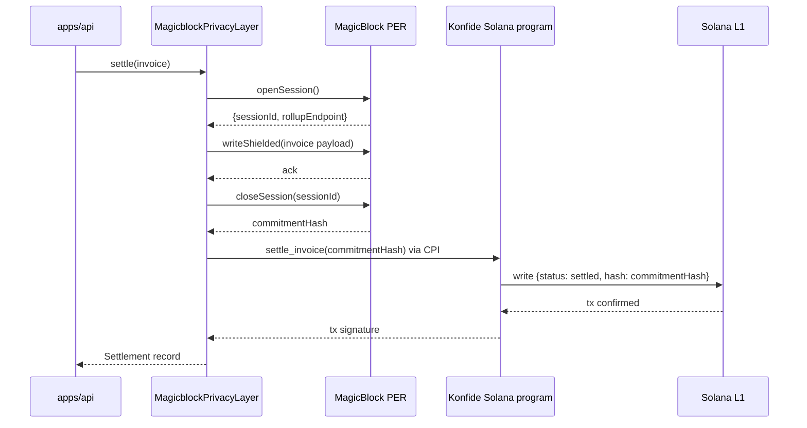

# Konfide × MagicBlock

This document is the submission for the MagicBlock sidetrack of the Solana Frontier Hackathon. Its intended reader is a MagicBlock judge evaluating technical depth and the genuine novelty of the privacy framing. MagicBlock weights "Technology" at 40%, so this document leads with the architectural argument rather than with a feature list.

## Project name

Konfide.

## One-liner

Confidential B2B settlements built on MagicBlock's Private Ephemeral Rollup, with a selective-disclosure design that keeps trades private from competitors and auditable for regulators.

## Problem

The B2B privacy problem on public chains is specific and unforgiving. A Shenzhen manufacturer accepting USDT-on-Tron from his Lagos customers does not just have a hypothetical privacy concern — he has competitors actively watching his wallet to infer his pricing structure, his customer list, and his sales velocity. Once a wallet is associated with a business, every payment to that wallet is commercially intelligible. For a mid-size manufacturer, that is the kind of information that costs deals.

The naive fix — fully shielded chains like Aleo or Penumbra — overcorrects. A regulator with an appropriate legal basis (a Chinese tax auditor, a Nigerian CBN compliance officer, a UAE VARA investigator) cannot reconcile a fully shielded ledger to actual trades, which means fully shielded ledgers fail compliance reviews and lose the customer base that needs them.

Konfide needs an architecture that is neither fully public nor fully private. The protocol calls this **selective disclosure**: amounts and counterparty mappings are private by default, the fact-of-settlement is public for regulatory auditability, and view keys allow targeted decryption to a specific party for a specific scope on appropriate process.

## Why public chains fail B2B today

Three concrete failure modes, all preventable:

The Tron-USDT mode. Every transaction is a row in a public table. Tunde's $12,000 payment to Wei is on the explorer. Wei's competitors see it. They learn his pricing. They learn his volume. They learn his customer concentration. They use that to undercut. This is the dominant mode in the Lagos-Shenzhen corridor today, and it is the failure mode Konfide is built to fix.

The fully-shielded mode. Aleo or Penumbra or Tornado-style design hides everything. A Chinese tax auditor presented with a shielded ledger cannot reconcile claimed export volume with on-chain reality. The audit fails. The user gets fined or banned. This is why fully shielded chains have not won B2B even though they have technically solved the privacy problem.

The mixer mode. Funds get washed through pools with no recipient verification. This is the mode regulators are most allergic to and the mode that does not solve the audit problem either, because there is no clean mapping between settled trades and audited records.

Konfide's architecture is none of these. Read carefully — this is the framing the submission depends on.

## The selective-disclosure thesis

The thesis has three layers, in this order:

**Layer 1: private by default.** When a settlement runs through Konfide, the amount and counterparty mapping are committed inside a MagicBlock Private Ephemeral Rollup (PER), not to Solana mainnet. Public observers — Wei's competitors, Tunde's competitors, anyone with a Solana explorer — see that an invoice has been settled. They do not see the amount, the parties, the line items, the FX rate, the memo, or anything else commercially sensitive. The L1 record is intentionally information-poor.

**Layer 2: auditable by design.** The fact-of-settlement is public. The Solana program records, for each invoice, the PDA address, the status flag (`settled` / `disputed` / etc.), and a 32-byte commitment hash that binds the on-chain record to the off-chain encrypted payload. A regulator inspecting Konfide's mainnet activity can verify that the protocol is doing what it claims — settling invoices, in chronological order, without reordering or back-dating. The protocol is audit-amenable because the auditor can verify aggregate behaviour without seeing individual amounts. This is the property fully shielded chains lack.

**Layer 3: selective disclosure on appropriate process.** Konfide issues view keys per-invoice or per-counterparty-history, scoped to a specific regulator request. A Nigerian CBN compliance officer with a documented basis for inspection can request a view key for a specific Lagos importer's three months of trade history. The view key decrypts the off-chain payload and verifies it against the on-chain commitment — meaning the regulator gets the truth, not a self-reported summary, but only for the scope they have process for. Konfide does not grant view keys automatically. The protocol provides the cryptographic primitive (`[TBD: signature scheme — likely Ed25519 envelopes with regulator-public-key-bound capability tokens]`) and a documented operational flow; the decision to grant a view key is a legal and operational decision carried out by a designated compliance officer at the protocol layer.

This three-layer model is what makes Konfide acceptable to both Wei (whose pricing stays private from competitors) and to the Chinese tax auditor (whose specific inspection request can be fulfilled). It is the architectural reason Konfide can target a customer cohort that fully-public and fully-private chains cannot.

## How we use Ephemeral Rollup and Private Ephemeral Rollup

Konfide opens a PER session for each settlement. The flow:

What lives in the PER session: the cleartext invoice amount, the buyer wallet, the seller wallet, the line items, the FX details, the memo. Nothing commercially sensitive ever touches L1.

What lands on L1: the invoice PDA, a status flag, a 32-byte commitment hash. These are publicly observable, but they are observably uninformative.

How a regulator reconciles: the regulator presents a request scoped to specific invoices or a specific counterparty's history window. Konfide's compliance officer issues view keys that decrypt the off-chain encrypted payload (stored in the `encrypted_payload` column of the `invoices` table) and verifies that the decrypted content hashes to the commitment on L1. The regulator now has cryptographically-attested ground truth about the requested scope, and only that scope.

The choice between plain ER and PER for Konfide: PER is required for Layer 1 of the disclosure model. Plain ER on its own does not give us the shielded-amount commitment — it gives us a fast off-chain compute environment that is still auditable from outside. PER adds the cryptographic primitive that makes "the L1 commitment is information-poor" actually true.

`[verify against MagicBlock docs: exact PER capabilities, session lifecycle, commitment scheme]`.

## Integration walkthrough

- Adapter: `packages/adapters/magicblock/src/magicblock-adapter.ts` implements `PrivacyLayer` from `packages/core/src/ports/privacy-layer.ts`.
- Client wrapper: `packages/adapters/magicblock/src/client.ts` wraps the rollup endpoint.
- Service: `packages/core/src/services/settlement-service.ts` calls `PrivacyLayer.settle(...)` as part of finalising a payment.
- Anchor program: `packages/contracts/programs/konfide/src/lib.rs`'s `settle_invoice` instruction accepts the commitment hash from the privacy layer and writes it to the invoice account.

The adapter is currently scaffolded with method stubs. Real implementation is Phase 6 in the [roadmap](../../ROADMAP.md#phase-6--magicblock-privacy-layer), targeting completion by 2026-05-27. Status at submission time: `[TBD: paste status as of submission day]`.

## What is working vs roadmap

This is the section judges will skip to first to find a misleading claim.

Working: the port abstraction (`PrivacyLayer`) and the architectural commitment to selective disclosure as a deliberate design rather than an afterthought. The adapter package compiles and is wired into the settlement service.

In progress (Phase 6): the actual PER session lifecycle, the shielded-amount commitment, the L1 CPI from MagicBlock's solver authority into our Anchor program, and the view-key issuance flow.

Honest framing: this submission's argument is "we have built the right architecture for selective disclosure on Solana, and MagicBlock's PER is the only substrate that lets us implement it." If the integration is not end-to-end live by 2026-05-27, the submission still holds because the architectural argument is independent of the implementation status. But we are aiming to ship.

## Future work

- Full agent-to-agent confidential commerce. Two AI agents transacting on behalf of two businesses without exposing the businesses' commercial relationships to each other or to observers.
- x402 confidential payment endpoints. Per-invoice payable URLs that an autonomous agent can hit with selective-disclosure receipts.
- Per-corridor compliance presets. Pre-configured view-key issuance policies for the Lagos-Guangzhou, Lagos-Istanbul, and Lagos-Dubai corridors that match each jurisdiction's documented requirements.
- ZK proof of solvency. Periodic public proof that aggregate inflows equal aggregate outflows across all settled invoices, without revealing per-invoice amounts.

## Code references

- Port: `packages/core/src/ports/privacy-layer.ts`
- Adapter: `packages/adapters/magicblock/src/magicblock-adapter.ts`
- Client: `packages/adapters/magicblock/src/client.ts`
- Settlement service: `packages/core/src/services/settlement-service.ts`
- Anchor program: `packages/contracts/programs/konfide/src/lib.rs` (`settle_invoice`)
- Webhook receiver: `apps/web/app/api/webhooks/magicblock/route.ts`

## Demo

- **Video** — `[TBD: 3-minute demo showing settlement on Solana with explorer view confirming the L1 record contains only commitment hash + status flag]`.
- **Live demo** — `[TBD]`.
- **GitHub** — `[TBD]`.

## Submission requirements checklist

`[verify against final MagicBlock brief]`:

- [ ] Working demo with successful MagicBlock integration.
- [ ] Public GitHub repository.
- [ ] 3-minute video.
- [ ] Clear technical explanation of how PER is used (this document, Layers 1–3 above).
- [ ] Explanation of why PER over plain ER (see "How we use Ephemeral Rollup and Private Ephemeral Rollup" above).
