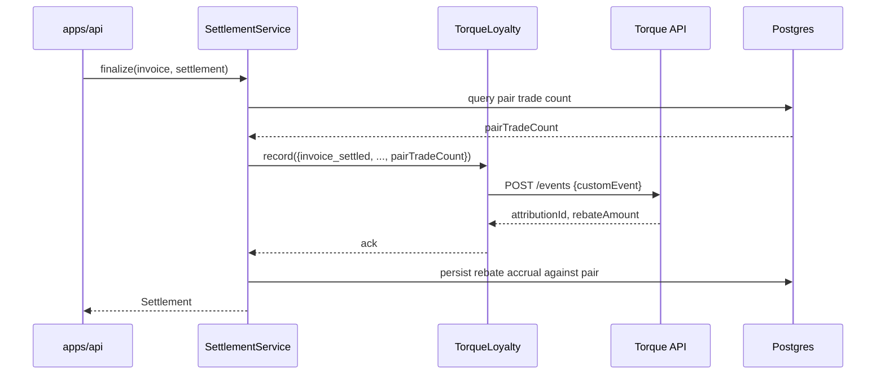

# Konfide × Torque

This document is the submission for the Torque sidetrack of the Solana Frontier Hackathon. Its intended reader is a Torque judge looking for measurable use of incentives. Torque scores live activity, not just code presence — so this document leads with the rebate logic and the simulated activity numbers.

## Project name

Konfide.

## One-liner

Programmable counterparty rebates that escalate with relationship depth, attributed automatically through Torque on every settled invoice.

## Problem

B2B retention is structurally different from consumer retention. Each trade is high-value (median $5K–50K in the Konfide wedge). Trades are intermittent (every two to four weeks for a typical Lagos-Shenzhen pair). Repeat-counterparty relationships are valuable but underincentivised: the supplier has no reason to discount a returning buyer beyond personal goodwill, and there is no protocol-level signal that "this is the fifth invoice with the same counterparty."

The result: the most economically important relationships in the Lagos-Guangzhou corridor — the ones that should produce switching costs and lock-in — are commercially invisible at the protocol layer. Konfide is the protocol layer. Adding a programmable rebate primitive that fires automatically on repeat trade is the right way to make these relationships protocol-legible.

## Solution

A counterparty pair (Tunde-Wei, for example) accumulates trade count automatically as Konfide settles their invoices. Torque's rebate engine emits an attribution on every settlement; the rebate amount escalates with the count. The rebate is credited toward the buyer's next Konfide settlement fee — they do not pay out of pocket and immediately receive a discount; they earn a discount that applies on the next trade. This shapes behaviour toward continued use of the same counterparty pair.

The rebate is symbolic for small trade counts (no rebate on the first trade, just to keep the model honest about new-pair risk) and meaningful by the time a pair reaches double digits (75 bps off the settlement fee, which compounds to the equivalent of one free trade after roughly 30 paid ones).

## Custom event schema

Konfide emits four custom events to Torque:

- `invoice_created` — when an issuer creates a new invoice. Payload: `{ issuerId, payerId, amount, currency, corridor, isRepeatPair, pairTradeCount }`.
- `invoice_settled` — when a settlement confirms. Payload: same as above plus `settlementId`, `routeUsed`, `actualFinalitySeconds`.
- `dispute_opened` — when a dispute is recorded. Reverses any pending rebate accrual for the affected invoice. Payload: `{ invoiceId, partyOpening, reasonCategory }`.
- `dispute_resolved` — when a dispute closes. Re-issues rebate accrual if the resolution is in favour of the buyer. Payload: `{ invoiceId, resolution }`.

`isRepeatPair` is a boolean Konfide computes from the pair's prior trade history. `pairTradeCount` is the integer count, which the rebate logic uses directly. Computing the count Konfide-side rather than Torque-side keeps the rebate logic deterministic from our perspective; Torque is the attribution and delivery layer, not the trade-counting source of truth.

## Rebate logic

Per pair (issuer + payer combination):

| Trade number             | Rebate (bps off settlement fee) |
| ------------------------ | ------------------------------- |
| 1st                      | 0 bps                           |
| 2nd                      | 30 bps                          |
| 3rd–4th                  | 40 bps                          |
| 5th–9th                  | 50 bps                          |
| 10th and onward          | 75 bps                          |

`[TBD: confirm exact tier numbers pending tuning against pilot user data]`. The numbers above are starting points chosen to make the second-trade rebate noticeable enough to drive return-visit behaviour, while keeping the steady-state cost low enough to preserve unit economics.

A 75 bps rebate on the 25 bps settlement fee is a 75% discount on that fee for repeat-pair trades, which compounds with the FX-spread share to give Konfide's most loyal customers a near-zero settlement-fee experience. This is the right loyalty curve for B2B: dramatic for committed pairs, neutral for new pairs.

## Friction log

Torque explicitly asks for a friction log on the integration experience. We start the log here and keep it up to date.

`[TBD: fill in once integration begins. Expected categories: API stability during devnet, doc gaps for custom-event schemas, the one-time access provisioning via Telegram group flow, observability of rebate attribution.]`

The friction-log expectation is part of why Torque's submission criteria are different from the others. We will not be retroactively constructing a friction log the night before submission — we will keep a running file in this repo that judges can read.

## Simulated activity metrics

Torque scores the live activity Konfide drives through the integration. To produce realistic numbers without 200 real pilot users in the hackathon window, we ship a simulation script (`tooling/scripts/simulate-trade.ts`) that generates a 30-day activity graph the judges can scrub through.

The simulation models 50 counterparty pairs across the Lagos-Guangzhou corridor, with realistic invoice cadence (every 2–4 weeks per pair), realistic invoice sizes ($5K–50K), and a 5% dispute rate. It emits `invoice_created` and `invoice_settled` events to Torque at the modelled timestamps, exercising the rebate-tier escalation across pairs that hit their 2nd, 5th, and 10th trade during the 30-day window.

Expected outputs from the simulation `[TBD: actual figures from runs]`:

- Total events emitted to Torque: ~600 across the 30 days.
- Rebates attributed: `[TBD]`.
- Pairs that crossed the 5th-trade threshold: `[TBD]`.
- Pairs that crossed the 10th-trade threshold: `[TBD]`.
- Cohort retention curve: `[TBD: paste graph image link]`.

The judge can run the simulation locally with `pnpm tsx tooling/scripts/simulate-trade.ts` to reproduce the numbers.

## Integration walkthrough

The adapter (`packages/adapters/torque/src/torque-adapter.ts`) implements the `Loyalty` port. The settlement service decides what events to emit; Torque decides what attribution applies. The split keeps the rebate logic deterministic from Konfide's side while letting Torque own the attribution and delivery.

## Code references

- Port: `packages/core/src/ports/loyalty.ts`
- Adapter: `packages/adapters/torque/src/torque-adapter.ts`
- Client: `packages/adapters/torque/src/client.ts`
- Settlement service that emits events: `packages/core/src/services/settlement-service.ts`
- Simulation script: `tooling/scripts/simulate-trade.ts`

## Demo

- **Video** — `[TBD: 3-minute demo showing rebate escalation across simulated trade history]`.
- **Live demo** — `[TBD]`.
- **GitHub** — `[TBD]`.

## Submission requirements checklist

`[verify against final Torque brief]`:

- [ ] Working integration emitting custom events to Torque.
- [ ] Public GitHub repository.
- [ ] Video demonstration.
- [ ] Friction log (kept in this document and updated as integration progresses).
- [ ] Measurable activity metrics from the simulation script.
- [ ] Clear rebate logic explanation (see "Rebate logic" above).
